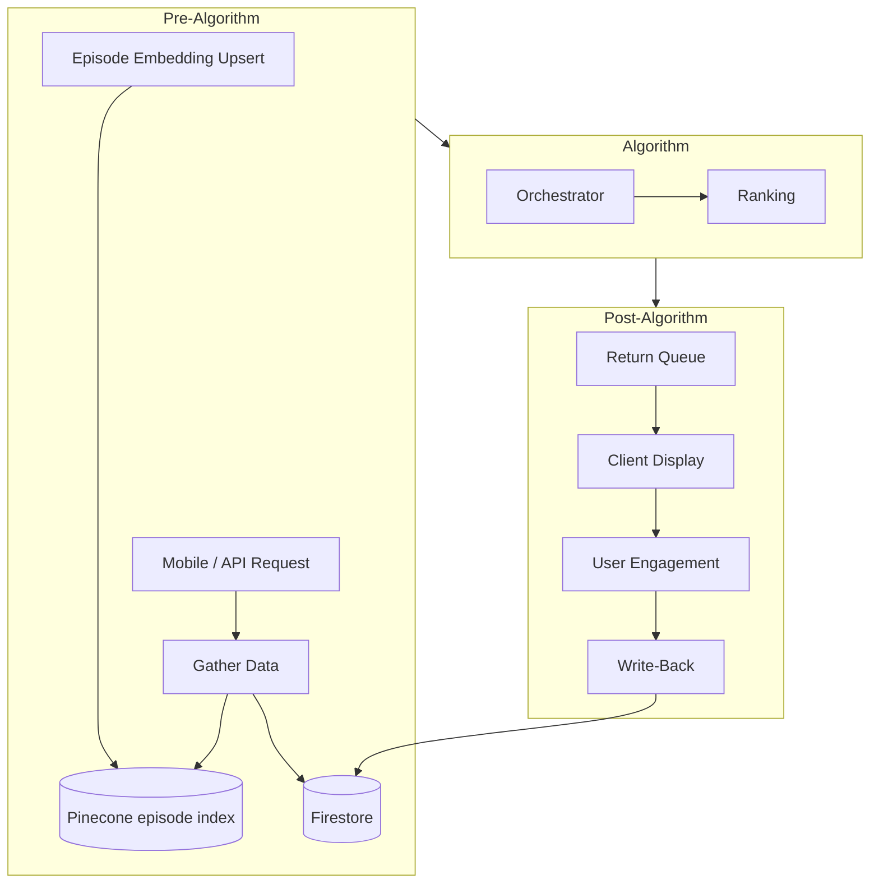
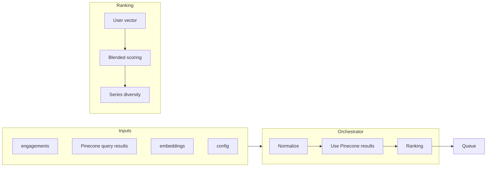

# For You Feed: End-to-End System Design

This document describes the full pipeline for the personalized "For You" recommendation feed: ingestion, read path (session create), the algorithm, and write-back (engagement persistence).

## Table of Contents

- [Overview](#overview)
- [System Architecture](#system-architecture)
- [Components](#components)
  - [Episode Ingestion](#21-episode-ingestion-existing-pipeline)
  - [Episode Embedding Upsert](#22-episode-embedding-upsert)
  - [Session Create and Data Gathering](#23-session-create-request-and-data-gathering)
  - [The Algorithm](#3-the-algorithm)
- [Keeping the Episode Embeddings Index Current](#4-keeping-the-episode-embeddings-index-current)
- [Write-Back: Persisting Engagements](#5-write-back-persisting-engagements)
- [How It Works (Full System)](#6-how-it-works-full-system)
- [Storage Summary](#7-storage-summary)
- [Key Design Decisions](#key-design-decisions)
- [References](#8-references)

---

## Overview

The For You feed retrieves and ranks podcast episodes from two inputs:

1. **Episode embeddings (Pinecone):** One vector per episode for similarity search; populated from Firestore episode data after transcript export.
2. **Engagement history (Firestore):** Episodes the user has clicked or bookmarked (V1); used to build a user vector for personalization.

Session create gathers engagements, user, and (when needed) episodes; runs the algorithm (Pinecone query → ranking for all cases); returns a ranked queue. **User vector cases:** (1) No engagements, no categories → Pinecone query with a uniform **all-categories** vector (same path as other cases). (2–4) Engagements and/or categories → Pinecone query with user vector (engagement mean, category anchor, or blend). If the all-categories vector cannot be generated (e.g. no OpenAI API key), the server returns an error. Write-back persists new clicks/bookmarks to Firestore so future sessions stay personalized.

The design combines quality filtering (credibility, insight), personalization (user vector or category cold-start), and series diversity in one configurable pipeline.

---

## System Architecture

---

## Components

### 2.1 Episode Ingestion (Existing Pipeline)

**Location:** Existing metaspark pipeline (initialize-episode, then Firestore, then transcription, then transcript_export).

Episodes land in Firestore podcast_episodes with scoring (credibility, insight), tagging (categories), and exec_overview (key_insight). The schema adapter maps these to rec_engine format for embedding and recommendations.

### 2.2 Episode Embedding Upsert

**Location:** Hook at end of transcript_export; backfill script for historical episodes.

One embedding per episode in Pinecone (separate index from RAG). Enables vector search for the For You feed. Each vector is stored with metadata used for (1) filtering at query time and (2) ranking and response when the query returns metadata.

**Metadata stored in Pinecone (per vector):**

- **Filtering (today):** credibility, insight, combined, published_at, episode_id — used by the hybrid filter (quality, freshness, exclusions).
- **Ranking and response (extend upsert to include):** title, key_insight, content_id, series_id, series_name, categories (e.g. as a JSON string; Pinecone metadata is flat). With these, the server can build the ranked queue and episode cards from the Pinecone query response alone (include_metadata=True) and does not need to fetch the episode catalog from Firestore for candidates on the vector-search path.

| Input | Output |
|-------|--------|
| Episode doc (Firestore) | Vector + metadata in Pinecone |
| Optional log collection | Idempotency (skip if already present) |

### 2.3 Session Create Request and Data Gathering

**Location:** Server on POST /sessions/create; data from Firestore and Pinecone.

Assembles engagements, user, episodes, and embeddings before calling the algorithm.

| Task | Source |
|------|--------|
| Engagements | Firestore users/{user_id}/engagements or request body (V1: click or bookmark only) |
| User | Firestore users/{user_id} (e.g. category_vector for cold-start) |
| Episodes | Firestore podcast_episodes (for episode metadata lookup when Pinecone does not return full metadata) |
| Engagement embeddings | Pinecone (fetch by engagement episode_ids) when server computes user vector |
| Candidates | Pinecone query with a query vector (user vector for Cases 2–4; uniform all-categories vector for Case 1) and metadata filter; returns candidates + scores. If no query vector can be obtained (e.g. Case 1 and no OpenAI API key), the server returns an error. |
| Exclusions | Engagement history plus client-excluded episode ids; passed in the Pinecone metadata filter so those episodes are never recommended |

**Vector-search path without Firestore for candidates:** When Pinecone stores and returns full metadata per vector (see 2.2), the server can build Episode objects and run ranking from the Pinecone query response alone. No Firestore episode fetch is required for the candidate list on this path.

**Mobile:** The client may send a precomputed user_vector and exclusions (from local engagement store). In that case the server uses the sent vector for the Pinecone query and does not fetch engagement embeddings or compute the user vector on the server.

---

## 3. The Algorithm

The algorithm takes engagements, an episode catalog (or Pinecone query results), embeddings, and config; it returns a ranked queue of episodes. It supports quality score filtering, personalization (user vector or category cold-start), and series diversity. Configuration and episode schema are defined in the algorithm package. V1 engagements are click and bookmark only.

### System Architecture (Algorithm)

For **all four cases**, the server runs a Pinecone query: user vector for Cases 2–4, and a uniform **all-categories** vector for Case 1 (no engagements, no categories). Same metadata filter (quality, freshness, exclusions) and top_k; the algorithm receives candidates + similarity and runs Ranking. If the all-categories vector cannot be generated (e.g. no OpenAI API key), the server returns an error.

### Components

#### Orchestrator

**Location:** [algorithm/stages/orchestrator.py](../algorithm/stages/orchestrator.py)

The single entry point for the algorithm. The server always provides Pinecone query results (all cases); the orchestrator uses those candidates and similarity scores and runs Ranking.

| Step | Description |
|------|-------------|
| Prepare | Prepare engagements and Pinecone query results (candidates + similarity) |
| Run | Ranking on the candidates; return the queue and user-vector count |

#### Ranking

**Location:** [algorithm/stages/ranking/](../algorithm/stages/ranking/)

User vector (optional), per-candidate blended score, then series diversity selection.

**Blended formula:** Final score is a weighted combination of similarity, quality, and recency. Similarity for each candidate comes from the vector search when the server ran one; otherwise a default value is used.

**User vector cases:** (1) No engagements, no categories → query vector = uniform all-categories vector; Pinecone query; similarity from Pinecone. (2) Engagements only → weighted mean of engagement embeddings; Pinecone query. (3) Categories only → category anchor; Pinecone query. (4) Both → blend of engagement mean and category anchor; Pinecone query.

| Step | Description |
|------|-------------|
| User vector | Compute user vector from recent engagements and optional category anchor (none, mean, category anchor, or blend) |
| Blended score | Similarity (from vector search or default) + quality + recency; final score is weighted combination |
| Diversity | Apply series diversity (limit per series, no adjacent same series) |

### How It Works (Algorithm)

**Pipeline stages**

1. Server invokes the full pipeline with engagements, exclusions, episodes or vector-search results, embeddings, and config.
2. Orchestrator loads config and prepares engagements and the episode list.
3. **Candidates:** The server always runs a Pinecone query; the algorithm uses its candidates and similarity scores.
4. **User vector:** Ranking computes the user vector (see Ranking for cases).
5. **Scores:** Per candidate, similarity from Pinecone; each candidate is scored (similarity, quality, recency) and sorted by final score.
6. **Diversity:** Series diversity selection is applied; final queue is returned.
7. Return (queue, user_vector_episodes).

**Requirements:** Episode schema (id, title, scores, key_insight, published_at, categories, etc.), engagement shape (episode_id, timestamp, type), embedding format, and config are defined in the algorithm package. The algorithm receives all data as inputs and does not access any database or network.

---

## 4. Keeping the Episode Embeddings Index Current

**Purpose:** Maintain the For You feed so it always includes new episodes. When a new episode is added to Firestore (after transcript export completes), we upsert its embedding into Pinecone so it can be recommended immediately.

**Trigger:** Hook at the end of transcript export (after write_tags_flow). A single-episode embed-and-upsert step is invoked.

**Flow:**
1. Convert Firestore episode doc to rec_engine format (schema adapter)
2. Generate one embedding via OpenAI (episode text and embedding model)
3. Build metadata (credibility, insight, published_at, episode_id)
4. Upsert to Pinecone episode embeddings index (namespace by algo and strategy)
5. Optional: write to a Firestore log collection for idempotency (skip if already present)

**Backfill:** For existing episodes that predate this hook, run a script that finds Firestore episodes with status indicating transcript export success that are missing from the index and runs single-episode upsert for each.

---

## 5. Write-Back: Persisting Engagements

After the algorithm returns the queue and the user sees episodes, we persist engagements (clicks, bookmarks) so future sessions personalize correctly.

### 5.1 Engagement Write-Back to Firestore

**Purpose:** When a user **clicks** or **bookmarks** an episode (V1; listen is not in scope), persist that to Firestore so the next session create uses it for the user vector and excludes it from recommendations.

**Endpoint:** POST /api/sessions/{session_id}/engage

**Request:** episode_id, type (click or bookmark), user_id, optional episode_title and series_name

**Flow:** (1) Add episode_id to the session's engaged and excluded sets; (2) engagement is written to Firestore users/{user_id}/engagements (document: episode_id, type, timestamp, optional episode_title and series_name). If user_id is empty, write is skipped.

**V1:** click and bookmark only. Config maps them to weights (e.g. bookmark > click).

### 5.2 Response and Display

- Server returns first page with session_id, total_in_queue, etc.
- POST /sessions/{id}/next returns more from the in-memory queue (no re-run).
- Mobile renders episodes; user can click or bookmark (V1).

### 5.3 Mobile: Local Engagement Store, User Vector on Device, Always Pinecone for Feed

**Engagement history (local storage)**

- **First load (app hard start):** Check whether engagement history is in sync with the backend; fetch engagement history from the API and save to local storage so the device has the latest list.
- **App already open:** Use engagement history from local storage (assume it is up to date).
- **When the user makes an engagement (click or bookmark):** (1) Fire an async task to update the backend API with the new engagement. (2) Update local storage engagement history immediately so the UI and any local computation see the new engagement without waiting for the server.

**User vector (on device, no Pinecone)**

- Compute the user vector locally from local-storage engagement data. Whenever engagement data changes, recalculate the user vector on the fly using local compute or a text-embedding API (e.g. OpenAI) for the engaged episodes’ text, then mean-pool (or weighted mean) on device. No Pinecone involved for this step.

**Feed (Pinecone every time, no cache)**

- Once the user vector is ready, call the backend with it; the server runs Pinecone search (hybrid filters + similarity) for candidates, then ranking, and returns the queue. Do not cache the feed results; recompute on each request (e.g. each time the user opens For You or refreshes) so the feed always reflects the latest catalog and the latest user vector.

---

## 6. How It Works (Full System)

**Backend / ingestion**

1. **Ingestion:** New episode → Firestore → transcript_export → episode embed + upsert → Pinecone episode embeddings index

**Mobile session flow (recommended)**

2. **First load:** If app just started, sync engagement history from backend and save to local storage.
3. **Engagement history:** Use local storage (synced on first load; updated immediately when user engages). On engage: async POST to backend to persist; update local storage in the moment.
4. **User vector:** Computed on device from local engagement data whenever it changes (local compute or text-embedding API); no Pinecone for this step.
5. **Request feed:** Client sends user_vector and exclusions (e.g. from local engagement ids) to POST /sessions/create. Server runs Pinecone search (hybrid filters + similarity) for candidates, then ranking; returns queue. No caching of feed results — recompute each time.
6. **Return:** First page to client; session stored in memory for load-more in that session.
7. **Display:** Client shows episodes; user can load more or engage.
8. **Engage:** Async POST to backend; update local storage immediately; user vector can be recomputed on device for the next feed request.

**Server-side (when handling session create)**

- Gather: user_vector and exclusions from request; user (Firestore, if needed for category anchor). When client sends user_vector, server does not fetch engagement embeddings or compute user vector; it uses the sent vector for Pinecone query only.
- **Pinecone query path (all cases):** For Case 1 the server uses a uniform all-categories vector; for Cases 2–4 the user vector. Same hybrid filter and top_k; candidates + scores from Pinecone; ranking; return queue. If the all-categories vector cannot be generated (e.g. no OpenAI API key), the server returns an error.

---

## 7. Storage Summary

| Storage | Contents |
|---------|----------|
| Firestore podcast_episodes | Episode catalog (title, publish_date, scoring, tagging, etc.) |
| Firestore podcast_series | Series metadata |
| Firestore users/{user_id} | User profile (display_name, category_interests, category_vector) |
| Firestore users/{user_id}/engagements | Engagement history (episode_id, type, timestamp, …) |
| Pinecone episode embeddings index | One embedding per episode for recommendations; namespace by algo/strategy/dataset. Metadata per vector: filtering (credibility, insight, published_at, etc.) and, when extended, full fields for ranking and response (title, series, key_insight, etc.) so the vector-search path need not read Firestore for candidate episodes. (Separate from RAG indexes.) |
| Optional: Firestore log collection | Idempotency for embedding upserts (e.g. rec_for_you_log) |
| In-memory state.sessions | Session queues (ephemeral; lost on restart) |

---

## Key Design Decisions

- **Single path for all cases:** Pinecone query with a query vector (all-categories for Case 1, user vector for Cases 2–4) returns candidates and similarity scores. If no query vector can be obtained (e.g. Case 1 without OpenAI API key), the server returns an error.
- **User vector for personalization:** User vector is computed from recent engagement embeddings (and optionally blended with category_anchor_vector for cold start). It drives similarity in blended scoring; no user vector means quality + recency only.
- **Blended scoring:** Final score combines similarity (from Pinecone or default), quality, and recency via configurable weights; ranking then applies series diversity so the feed is not dominated by one series.
- **Exclusions:** Union of engagement history and client-excluded episode ids so already-seen or explicitly excluded episodes are never recommended.
- **No DB inside algorithm:** All data (engagements, episodes, embeddings, config) is passed in; the algorithm has no direct Firestore or Pinecone access, which keeps it testable and portable.
- **Mobile: user vector on device, feed from Pinecone each time:** Engagement history lives in local storage (synced on first load; updated in the moment when the user engages, with async write to backend). User vector is computed on device from that data (local compute or text-embedding API); when the client requests the feed, it sends the user vector and exclusions. The server runs Pinecone search (hybrid filters + similarity) and ranking and returns the queue. Feed results are not cached; each request gets a fresh queue so the feed stays current.
- **Pinecone metadata for filtering, ranking, and response:** We store per-vector metadata in Pinecone: filtering fields (credibility, insight, combined, published_at, episode_id) today; extended with title, key_insight, content_id, series_id, series_name, categories so the query can return everything needed for ranking and episode cards. With include_metadata=True, the server builds the ranked queue from the Pinecone response alone on the vector-search path and does not need to fetch the episode catalog from Firestore for candidates.
- **Case 1 all-categories vector:** For no engagements and no categories, the server uses a uniform “all categories” embedding (fixed text covering broad topics) as the Pinecone query vector so Case 1 uses the same path as other cases. Generated once per algorithm (cached); requires OpenAI API key. If it cannot be generated, the server returns an error.

---

## 8. References

- [DESIGN_OVERVIEW.md](DESIGN_OVERVIEW.md) -- High-level architecture
- [SESSION_FLOW.md](SESSION_FLOW.md) -- Step-by-step session create
- [PINECONE_FIRESTORE_DATA_FLOW.md](PINECONE_FIRESTORE_DATA_FLOW.md) -- Data sources and populate script
- [ALGORITHM_SUMMARY.md](ALGORITHM_SUMMARY.md) -- Algorithm details
- Algorithm Design Doc plan -- for full algorithm component breakdown
- Rec Engine Cloud Run and Merge plan -- for ingestion implementation, merge layout, and mobile wiring
