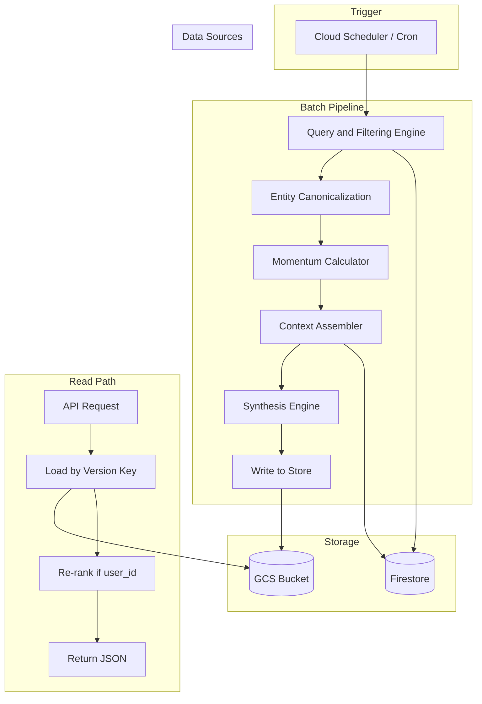

# Trending Insights: System Design

A batch pipeline that computes momentum for entities (organizations and people) across the podcast corpus, assembles evidence from transcripts and assembly outputs, synthesizes headlines and summaries via LLM, and serves a JSON payload to the prosumer app. Optional post-generation re-ranking by user interests is applied at read time.

---

## Table of Contents

- [1. What & Why](#1-what--why)
- [2. High-Level Flow](#2-high-level-flow)
- [3. Components and I/O](#3-components-and-io)
- [4. End-to-End Data Flow](#4-end-to-end-data-flow)
- [5. Subsystems Deep-Dive](#5-subsystems-deep-dive)
- [6. Storage and Data Sources](#6-storage-and-data-sources)
- [7. API Contract](#7-api-contract)
- [8. Key Design Decisions](#8-key-design-decisions)
- [9. Phase 2 (Post–Launch)](#9-phase-2-postlaunch)
- [10. References](#10-references)

---

## 1. What & Why

**What:** A scheduled (cron-driven) pipeline that (1) queries Firestore for entity mention counts in a current and a baseline time window, (2) computes momentum scores for entities (organizations and people only), (3) assembles evidence from episode tags and assembly responses (insights, data points, top quotes), (4) runs an LLM to produce a headline and summary per trending entity, and (5) writes the result to storage under a version key. The read path serves this precomputed payload; when a `user_id` is provided, the list is re-ranked by the user’s saved categories/interests. Entity identifiers are passed through a separate canonicalization component (black box); the pipeline does not define how it works.

**Why:** Provide a “Trending Insights” experience analogous to “LinkedIn News Top stories” or “Today’s News” on X/Twitter: surface which companies and people are gaining narrative momentum in the corpus so prosumer users can discover what’s moving in the market without searching. The design keeps the heavy work (counts, context assembly, LLM synthesis) in a batch so the API stays fast and cacheable.

---

## 2. High-Level Flow



---

## 3. Components and I/O

| Component | Input | Output |
|-----------|-------|--------|
| **Query & Filtering Engine** | `target_date`, `hindsight_window` (e.g. `7d`), optional `domain_filter` | Raw list: `(entity, type, count_current, count_baseline, episode_ids[])` per entity |
| **Entity Canonicalization** | Raw entity identifiers (e.g. tag values) | Canonical entity IDs/names (black box; spec not in scope) |
| **Momentum Calculator** | Raw counts (current vs baseline) per canonical entity | Top 20 entities with `momentum_signal` (baseline ≥ 3; optional raw counts) |
| **Context Assembler** | Top 20 entity identifiers | Per-entity text blob: tag contexts + assembly snippets (insights, data_points, top_quotes, new_ideas); credibility applied when selecting evidence |
| **Synthesis Engine** | Per-entity context blobs | Per-entity `headline`, `summary` (and optional `evidence_refs`) |
| **Write** | Synthesized trend list + version key | GCS object keyed by `(target_date, hindsight_window, domain_filter)` (e.g. `trending_insights/{key}.json`) |
| **API (read path)** | `target_date`, `hindsight_window`, `domain_filter`, `limit`, optional `user_id` | Load precomputed result by version key; re-rank by user interests if `user_id` present; return JSON |

---

## 4. End-to-End Data Flow

1. **Trigger:** Cron (e.g. Cloud Scheduler) invokes the batch pipeline **once per day** (e.g. early morning) with fixed or derived `target_date` and `hindsight_window`.
2. **Query & Filter:** Pipeline queries Firestore for entity mentions in the **current window** `[target_date - window, target_date]` and the **baseline window** (same length immediately before). Entities = organizations + people only. Counts are not filtered by credibility (all episodes count).
3. **Canonicalization:** Raw entity identifiers are passed through the canonicalization component; downstream steps use canonical IDs/names.
4. **Momentum:** For each canonical entity, compute momentum (ratio current/baseline). Require baseline ≥ 3 for eligibility. Rank and take top 20.
5. **Context Assembler:** For each of the top 20 entities, fetch evidence: tag context and assembly responses (insights, data_points, top_quotes, new_ideas) from episodes that mention the entity. When selecting which evidence to include, **prefer or weight high-credibility episodes** (e.g. using `podcast_episodes` scoring or `content_scores` on tags). Do not exclude low-credibility episodes from the count step; only apply credibility at evidence assembly.
6. **Synthesis:** For each entity, run the LLM on the assembled context to produce a short headline and summary. Optionally attach evidence refs.
7. **Write:** Persist the trend list under a **version key** `(target_date, hindsight_window, domain_filter)` in **GCS** (e.g. bucket path `trending_insights/{key}.json`). No TTL; each run overwrites or creates the object for that key.
8. **Read path:** Client calls the API with `target_date`, `hindsight_window`, optional `domain_filter`, `limit`, and optional `user_id`. Server loads the precomputed result for that version key. If `user_id` is present, re-rank the list using the user’s saved categories/interests (e.g. boost entities that appear in episodes tagged with those categories). Return the top `limit` items as JSON.

---

## 5. Subsystems Deep-Dive

### 5.1 Query & Filtering Engine

**Input:** `target_date`, `hindsight_window` (string with unit, e.g. `7d`, `24h`, `30d`), optional `domain_filter` (e.g. category id/name).

**Process:** Parse `hindsight_window` into a time delta. Query Firestore to get **entity mention counts** in (1) current window and (2) baseline window. Entities = organizations + people only. **At launch, use embedded tagging:** stream `podcast_episodes` in the date range and extract/count entity tags from `tagging` (e.g. `v1_tag_orgs`, `v1_tag_people` or structure like `episode_data/data.json`: `orgs[]` / people with `name`, `relevance`, `context`). A `content_tags` collection can be used in Phase 2 for more efficient aggregation. Do **not** filter by credibility at this step; all episodes count toward momentum.

**Output:** Raw list of `(entity_id or tag_value, tag_type, count_current, count_baseline, episode_ids[])` (or equivalent).

**Engineering trade-offs:**

- **On-the-fly aggregation:** Easiest to build; Firestore read cost and latency grow with corpus size. **Chosen for launch.**
- **Materialized views:** Precompute daily (or hourly) counts per entity in a separate collection or BigQuery; pipeline reads from that. Freshness = refresh cadence; much faster and cheaper at read time. Phase 2.
- **Time-series DB:** Best fit for sliding-window analytics; new infrastructure. Phase 2.

---

### 5.2 Momentum Calculator

**Input:** Raw counts (current and baseline) per canonical entity from the Query step.

**Process:** Compute a **momentum score** per entity as growth ratio `current / baseline`. **Eligibility:** require **baseline ≥ 3** to avoid small-number noise (e.g. 1→5). Rank entities by this score and take the **top 20**. Output those entity identifiers with `momentum_signal` (and optionally raw counts for debugging).

**Output:** Top 20 entity identifiers with `momentum_signal` (and optionally raw counts for debugging).

**Engineering trade-offs:**

- **Simple growth ratio + minimum count (baseline ≥ 3):** **Chosen for launch.**
- **Z-score / statistical anomaly:** Better at surfacing true outliers; requires variance/history. Phase 2.

---

### 5.3 Context Assembler

**Input:** Top N entity identifiers (canonical) from the Momentum step.

**Process:** For each entity, gather **evidence**: (1) Tag context for that entity from episodes in the window (from embedded tagging context, or `content_tags.tag_context` when used). (2) Assembly responses from `podcast_queries` for `question_type` in **`['insights','data_points','top_quotes','new_ideas']`** for episodes that mention the entity. Link episodes to entities via the same tag source used in the Query step. When **selecting** which evidence to include, **prefer or weight high-credibility episodes** (e.g. using `podcast_episodes` scoring or `content_scores` on tags). Do not exclude low-credibility episodes from the initial count; credibility is applied only here.

**Output:** Per-entity blob of text (concatenated contexts + assembly snippets) for the Synthesis step.

**Engineering trade-offs:**

- **Relational joins (Firestore):** Get episode IDs from tags → fetch `podcast_queries` by `podcast_episode_id`. **Chosen for launch.**
- **Vector search:** Query entity name + date range against the RAG/vector store for untagged mentions; better recall, more latency and cost. Phase 2.

---

### 5.4 Synthesis Engine (Storyteller)

**Input:** Per-entity context blobs from the Context Assembler (tag context, assembly responses: `insights`, `data_points`, `top_quotes`, `new_ideas`). Context should include episode-level credibility (e.g. `v1_credibility` score or rationale) when available so the model can signal authority without inventing facts.

**Process:** For each entity (or in a batched prompt), the LLM produces a short **headline** and **summary** (2–3 sentences) explaining why the entity is trending. **Context cap:** use the model’s full context window (e.g. frontier models with very large input context, on the order of hundreds of thousands of input tokens); no artificial cap below the model maximum.

**Output:** Unstructured text per trend item: `headline`, `summary`, and optional `evidence_refs`.

#### Synthesis prompt guidance (narrative style)

Headlines and summaries should follow a **LinkedIn Top Stories / X Today’s News** style: data-anchored, action-oriented, and fact-preserving. The following rules are part of the contract for the Synthesis Engine:

- **Headline:** Prefer **data-anchored**, **action-oriented** headlines (entity or speaker + specific claim or metric). When the evidence includes a strong **top_quote** or **new_ideas** (contrarian) item, derive the headline from that when possible rather than a generic summary. Include concrete numbers or time horizons (e.g. “36 months”, “100GW”) when they appear in the evidence. Avoid meta or vague phrasing (e.g. “dominate narrative momentum”).
- **Summary:** One to three sentences in a “why it matters” style. Include at least one **specific metric or fact** from `data_points` when available. Do not alter or exaggerate numeric or factual claims from the evidence.
- **Contrarian / top-quote:** When `new_ideas` or `top_quotes` are present and relevant to why the entity is trending, the headline or summary should reflect that hook rather than a generic takeaway.
- **Credibility:** The synthesis prompt receives source credibility (e.g. episode `v1_credibility` or rationale). The summary may briefly signal authority (e.g. “High-credibility source (Series X)”) without inventing facts.
- **Fact preservation:** Headlines and summaries must not alter or contradict numeric or factual claims from the assembled evidence; treat `data_points` and direct quotes as anchors.

**Engineering trade-offs:**

- **Single prompt per entity, up to model context limit:** **Chosen for launch.** No artificial cap below the model’s maximum input context (e.g. ~276K input tokens for current frontier models).
- **Map-reduce:** Summarize per-episode (map), then combine into headline+summary (reduce); more orchestration. Phase 2.

---

### 5.5 Delivery & Personalization Router

**Input:** Synthesized trend list (entity, headline, summary, momentum_signal, source episodes); API params `limit`, optional `user_id`.

**Process:** Format into the **final JSON schema**. If `user_id` is present, **re-rank** the list using the user’s saved categories/interests (e.g. from Firestore `users/{user_id}` or rec_engine engagement): boost entities that appear in episodes tagged with the user’s preferred categories. No per-user LLM synthesis; only reordering.

**Output:** JSON payload for the client (see [7. API Contract](#7-api-contract)).

**Engineering trade-offs:**

- **Post-generation re-rank only:** Precomputed global list; on request, reorder by user profile and return top `limit`. **Chosen for launch.**
- Pre-generation personalization (user in the prompt) is out of scope for 30-day launch.

---

## 6. Storage and Data Sources

| Source | Contents / Role |
|--------|------------------|
| **Firestore `podcast_episodes`** | Episode catalog: `publish_date`, scoring (e.g. `v1_credibility`, `v1_insight`), tagging (e.g. embedded `v1_tag_orgs`, `v1_tag_people` or equivalent). Used for time-window filtering and credibility weighting in the Context Assembler. |
| **Firestore `podcast_queries`** | Assembly outputs per episode: `question_type` (`insights`, `new_ideas`, `data_points`, `top_quotes`), `assembly_response`, `podcast_episode_id`. Used by Context Assembler for evidence. Schema aligns with `episode_data/assembly.json`. |
| **Firestore entity tags** | Either **embedded** in `podcast_episodes.tagging` (e.g. orgs/people with `name`, `relevance`, `context` as in `episode_data/data.json`) or in a **`content_tags`** collection with `tag_type`, `tag_value`, `publish_date`, `tag_context`, `content_id`. Used by Query for counts and by Context Assembler for context and episode–entity linkage. |
| **Precomputed results (GCS)** | Trend list stored by **version key** `(target_date, hindsight_window, domain_filter)` (e.g. GCS path `trending_insights/{key}.json`). API reads by this key; no TTL. |
| **Firestore `users` (optional)** | User profile / category interests for re-ranking when `user_id` is provided. |

---

## 7. API Contract

**Endpoint:** `GET /api/recommendations/trending-insights` (or `GET /api/insights/trending`). Align with existing placeholders in `rec_engine/frontend/README.md`.

**Query parameters:**

| Parameter | Type | Required | Description |
|-----------|------|----------|-------------|
| `target_date` | string (YYYY-MM-DD) | No | Reference date for the window (default: today) |
| `hindsight_window` | string | No | Length of current (and baseline) window, e.g. `7d`, `24h`, `30d` (default: e.g. `7d`) |
| `domain_filter` | string | No | Optional category id/name to restrict scope |
| `limit` | int | No | Max number of trend items to return (default: 10) |
| `user_id` | string | No | If present, re-rank results by this user’s interests |

**Response schema:** List of trend items. Each item:

| Field | Type | Description |
|-------|------|-------------|
| `entity_id` or `entity_name` | string | Canonical identifier or display name |
| `entity_type` | string | `"organization"` or `"person"` |
| `headline` | string | Short, data-anchored headline (narrative style; see §5.4 Synthesis prompt guidance) |
| `summary` | string | 1–3 sentence “why it matters” summary |
| `momentum_signal` | number | Momentum score (e.g. ratio or normalized value) |
| `source_episodes` | array | `{ id, title, series_name, publish_date, link }` (optional) |
| `evidence_refs` | array | Optional references into assembly or quotes |

**Display:** The API always returns both `entity_name` (or `entity_id`) and `headline`. The client may display either (a) the headline only, (b) the entity as a label with the headline as body, or (c) another layout; both patterns are valid.

**Example response (narrative style):**

```json
{
  "version_key": {
    "target_date": "2026-02-24",
    "hindsight_window": "7d",
    "domain_filter": null
  },
  "trends": [
    {
      "entity_name": "xAI",
      "entity_type": "organization",
      "headline": "Musk: Space-based AI compute will be 10x cheaper than Earth within 36 months",
      "summary": "Elon Musk argues orbital data centers will beat terrestrial on cost in under three years—5x solar efficiency in space, no batteries—with SpaceX’s launch cadence central to the bet. High-credibility source (Cheeky Pint).",
      "momentum_signal": 4.2,
      "source_episodes": [
        {
          "id": "elon-musk-on-spa-nfuz1q-y5dzsl",
          "title": "Elon Musk on Space GPUs, AI, Optimus, and his manufacturing method",
          "series_name": "Cheeky Pint",
          "publish_date": "2026-02-05"
        }
      ]
    }
  ]
}
```

---

## 8. Key Design Decisions

- **Entities only:** Trending is scoped to organizations and people; themes/categories are not in scope for the initial launch.
- **Credibility at evidence only:** All episodes contribute to mention counts. When assembling context for synthesis, prefer or weight high-credibility episodes; do not filter out low-credibility episodes in the Query step.
- **Entity canonicalization:** A separate component (black box) canonicalizes entity identifiers. The pipeline passes raw identifiers through it and uses the result downstream; this document does not specify the canonicalization logic.
- **Version key for cache:** Precomputed results are stored under `(target_date, hindsight_window, domain_filter)`. Each batch run writes the doc for that key; the API reads by key. No TTL; always serve the latest precomputed result for the requested key.
- **Scheduled batch for launch:** The pipeline runs **once per day** (e.g. Cloud Scheduler); the read path serves precomputed JSON from GCS and only applies re-rank when `user_id` is present. Request-time full pipeline is not in scope for launch.
- **Post-generation re-rank only:** Personalization is reordering the global trend list by user categories/interests; no user-specific LLM synthesis.
- **Time window format:** `hindsight_window` is a string with unit (e.g. `7d`, `24h`, `30d`); the pipeline parses it to derive current and baseline windows.
- **Tag source at launch:** Embedded `podcast_episodes.tagging`; stream episodes in date range and extract entity tags. `content_tags` collection is Phase 2 for scale.
- **Precomputed storage:** GCS (e.g. `trending_insights/{version_key}.json`). Firestore is not used for the trend list at launch.
- **Resolved trade-offs (launch):** Query = on-the-fly aggregation; Momentum = ratio + baseline ≥ 3, top 20; Context = Firestore joins, include `new_ideas` in evidence; Synthesis = single prompt per entity, context up to model max; Delivery = post-generation re-rank only; Trigger = once per day; Storage = GCS.

---

## 9. Phase 2 (Post–Launch)

- **Query:** Materialized entity counts per time window (separate collection or BigQuery); optional time-series DB for sliding-window analytics. Migrate to `content_tags` for efficient aggregation.
- **Momentum:** Z-score or statistical anomaly detection for momentum instead of (or in addition to) simple ratio.
- **Synthesis:** Map-reduce summarization if context outgrows single-prompt comfort; optional multi-step orchestration.
- **Context:** Vector search to include untagged mentions when assembling evidence.
- **Scope:** Theme/category-based trending (separate or unified with entities).

---

## 10. References

- [DATA_MODEL.md](../../metaspark-main/api_svc/docs/DATA_MODEL.md) — Firestore collections: `podcast_series`, `podcast_episodes`, `podcast_queries`
- [CONTENT_TAGS.md](../../metaspark-main/api_svc/docs/CONTENT_TAGS.md) — Tag index design and `content_tags` schema
- [END_TO_END_SYSTEM_DESIGN.md](END_TO_END_SYSTEM_DESIGN.md) — For You feed design (sessions, Pinecone, Firestore)
- [Frontend README](../frontend/README.md) — API placeholders including `trending-insights` / `trending/{category}`
- Episode data schema (entity and assembly structure): `episode_data/data.json` (orgs, people, categories), `episode_data/assembly.json` (data_points, insights, new_ideas, top_quotes)
