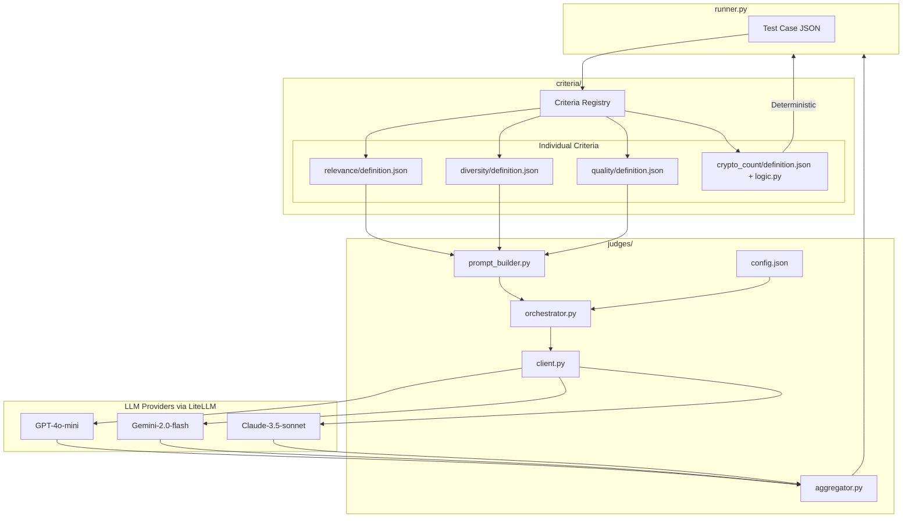

# Phase 6 Revised: Multi-LLM Judge Infrastructure

## Problem Statement

Current LLM evaluation has variability issues (Test 01 passes ~50% of runs with identical inputs). The existing `llm_judge.py` uses:

- Single LLM (Gemini) with `temperature=0.0` (research shows this is suboptimal)
- No repeated sampling
- No uncertainty metrics
- Monolithic design that doesn't scale
- Ignores `llm_criteria.focus_areas` and `prompt_hint` defined in test cases

## Design Principles

1. **LLM is Core**: No optional flags. LLM evaluation always runs. API key required.
2. **Modular Criteria**: Each criterion is its own folder with definition.json + README.md
3. **Two Criterion Types**: Deterministic (Python functions) and LLM (prompt-based)
4. **Per-Criterion LLM Calls**: Each LLM criterion gets its own API call (more modular, better debugging)
5. **Scalability**: Add new criteria/tests/LLM providers without code changes

---

## Architecture Overview



---

## Directory Structure

```
rec/evaluation/
├── judges/                           # NEW: LLM evaluation package
│   ├── __init__.py                   # Package exports
│   ├── client.py                     # LiteLLM unified interface (async)
│   ├── orchestrator.py               # Multi-LLM coordination + parallel execution
│   ├── aggregator.py                 # Two-stage aggregation logic
│   ├── prompt_builder.py             # Dynamic prompt construction from criteria
│   └── config.json                   # Externalized judge settings
│
├── criteria/                         # NEW: Modular criterion definitions
│   ├── __init__.py                   # Registry: loads all criteria from subfolders
│   ├── base.py                       # Base classes for criterion types
│   │
│   ├── relevance/                    # LLM criterion example
│   │   ├── definition.json           # type: "llm", prompt, scoring rubric
│   │   └── README.md                 # Documentation
│   │
│   ├── diversity/
│   │   ├── definition.json
│   │   └── README.md
│   │
│   ├── quality/
│   │   ├── definition.json
│   │   └── README.md
│   │
│   ├── hypothesis_alignment/
│   │   ├── definition.json
│   │   └── README.md
│   │
│   ├── category_alignment/
│   │   ├── definition.json
│   │   └── README.md
│   │
│   ├── topic_breadth/
│   │   ├── definition.json
│   │   └── README.md
│   │
│   ├── avg_credibility/              # Deterministic criterion example
│   │   ├── definition.json           # type: "deterministic"
│   │   ├── logic.py                  # Python function
│   │   └── README.md
│   │
│   └── crypto_count/                 # Another deterministic criterion
│       ├── definition.json
│       ├── logic.py
│       └── README.md
│
├── deprecated/                       # NEW: Deprecated code (for reference only)
│   └── llm_judge.py                  # Old single-LLM judge
│
├── test_cases/                       # EXISTING (unchanged structure)
│   ├── 01_cold_start_quality.json
│   ├── 01_cold_start_quality.md
│   └── ...
│
├── profiles/                         # EXISTING (unchanged)
├── runner.py                         # MODIFY: Use judges package, LLM always runs
└── requirements.txt                  # MODIFY: Add litellm
```

---

## Criterion Definition Schema

### LLM Criterion (`criteria/relevance/definition.json`)

```json
{
  "id": "relevance",
  "type": "llm",
  "name": "Relevance",
  "version": "1.0",
  "description": "Evaluates if recommendations match the user's content hypothesis",
  "scoring": {
    "scale": [1, 10],
    "default_threshold": 6.0
  },
  "prompt_template": "Evaluate RELEVANCE on a scale of 1-10:\n\nDo the recommendations match the user's content hypothesis?\n- Consider their Specialization vs. Exploration ratio\n- Consider their Cross-Disciplinary Curiosity level\n\nScoring Guide:\n- 10: Recommendations perfectly match the content hypothesis\n- 7-9: Strong alignment with minor gaps\n- 4-6: Partial alignment, some content doesn't fit\n- 1-3: Recommendations conflict with user preferences\n\nRespond with JSON: {\"score\": <1-10>, \"reasoning\": \"<brief explanation>\"}",
  "response_schema": {
    "score": "number",
    "reasoning": "string"
  },
  "tags": ["core", "personalization"]
}
```

### Deterministic Criterion (`criteria/avg_credibility/definition.json`)

```json
{
  "id": "avg_credibility",
  "type": "deterministic",
  "name": "Average Credibility",
  "version": "1.0",
  "description": "Computes average credibility score of top N episodes",
  "scoring": {
    "scale": [0, 5],
    "default_threshold": 3.0
  },
  "function": "compute_avg_credibility",
  "parameters": {
    "top_n": 10
  },
  "tags": ["quality", "deterministic"]
}
```

### Deterministic Logic (`criteria/avg_credibility/logic.py`)

```python
"""Average Credibility Criterion - Deterministic"""

def compute_avg_credibility(response: dict, params: dict) -> dict:
    """
    Compute average credibility of top N episodes.
    
    Args:
        response: API response with episodes
        params: {"top_n": 10}
    
    Returns:
        {"score": float, "passed": bool, "details": str}
    """
    episodes = response.get("episodes", [])[:params.get("top_n", 10)]
    
    if not episodes:
        return {"score": 0, "passed": False, "details": "No episodes returned"}
    
    credibilities = [ep["scores"]["credibility"] for ep in episodes]
    avg = sum(credibilities) / len(credibilities)
    
    return {
        "score": round(avg, 2),
        "passed": avg >= params.get("threshold", 3.0),
        "details": f"avg_credibility={avg:.2f} (n={len(episodes)})"
    }
```

---

## Test Case References Criteria

Test cases reference criteria by ID. The runner loads criteria definitions and evaluates accordingly.

```json
{
  "test_id": "01_cold_start_quality",
  "name": "Cold Start Quality & Topic Breadth",
  "description": "...",
  
  "criteria": [
    {
      "id": "avg_credibility",
      "threshold": 3.0,
      "params": {"top_n": 10}
    },
    {
      "id": "quality",
      "threshold": 6.0
    },
    {
      "id": "diversity",
      "threshold": 6.0
    },
    {
      "id": "topic_breadth",
      "threshold": 6.0
    }
  ],
  
  "llm_prompt_hint": "Evaluate if these recommendations (1) are high-quality content, (2) span multiple major themes...",
  
  "setup": {
    "engagements": [],
    "excluded_ids": []
  }
}
```

---

## Key Design Decisions

| Decision | Choice | Rationale |
|----------|--------|-----------|
| Criterion Granularity | Per-criterion LLM calls | Maximum modularity, easier debugging, per-criterion scoring |
| Criterion Types | Deterministic + LLM | Support both computed metrics and qualitative LLM judgment |
| Aggregation | Two-stage mean | Research-backed: mean within model, then mean across models |
| Temperature | 0.8 | Research shows temp>0 gives better calibration |
| Default N | 3 per judge | Balance between reliability and cost/time (configurable via UI) |
| N Configurable | Yes | Users can adjust N (1-10) via UI settings for reliability vs cost tradeoff |
| Model Selection | UI-configurable | Users can enable/disable LLM providers via settings modal |
| Async | Python asyncio | Required for reasonable run times with many API calls |
| LLM Mode | Always on | LLM is core to the system, not optional |
| Fallback | Graceful degradation | If one LLM provider fails, continue with others |

---

## Implementation Details

### judges/client.py - LiteLLM Wrapper

```python
"""Unified LLM client using LiteLLM for async multi-provider support."""

import json
from typing import Optional
import litellm
from litellm import acompletion

SUPPORTED_MODELS = {
    "openai": "gpt-5-mini",
    "gemini": "gemini/gemini-2.5-flash",
    "anthropic": "claude-sonnet-4-5"
}

async def call_llm(
    provider: str,
    prompt: str,
    temperature: float = 0.8,
    response_schema: Optional[dict] = None
) -> dict:
    """
    Call LLM provider with prompt and return parsed JSON response.
    
    Args:
        provider: One of "openai", "gemini", "anthropic"
        prompt: The evaluation prompt
        temperature: Sampling temperature (default 0.8)
        response_schema: Expected response structure (for validation)
    
    Returns:
        Parsed JSON response from LLM
    """
    model = SUPPORTED_MODELS.get(provider)
    if not model:
        raise ValueError(f"Unsupported provider: {provider}")
    
    response = await acompletion(
        model=model,
        messages=[{"role": "user", "content": prompt}],
        temperature=temperature,
        response_format={"type": "json_object"}
    )
    
    content = response.choices[0].message.content
    return parse_json_response(content)


def parse_json_response(content: str) -> dict:
    """Parse JSON from LLM response, handling various formats."""
    import re
    
    # Try direct parse
    try:
        return json.loads(content.strip())
    except json.JSONDecodeError:
        pass
    
    # Try extracting from markdown code block
    match = re.search(r'```(?:json)?\s*(\{[\s\S]*?\})\s*```', content)
    if match:
        try:
            return json.loads(match.group(1))
        except json.JSONDecodeError:
            pass
    
    # Try finding any JSON object
    match = re.search(r'\{[\s\S]*\}', content)
    if match:
        try:
            return json.loads(match.group())
        except json.JSONDecodeError:
            pass
    
    raise ValueError(f"Could not parse JSON from response: {content[:200]}...")
```

### judges/orchestrator.py - Multi-LLM Coordination

```python
"""Orchestrates multi-LLM evaluation with parallel execution."""

import asyncio
from typing import Dict, List
from .client import call_llm
from .prompt_builder import build_criterion_prompt
from .aggregator import aggregate_within_model, aggregate_across_models

async def evaluate_criterion(
    criterion: dict,
    profile: dict,
    response: dict,
    test_case: dict,
    config: dict
) -> dict:
    """
    Evaluate a single LLM criterion across all enabled judges.
    
    Args:
        criterion: Criterion definition from criteria/
        profile: User profile
        response: API response with recommendations
        test_case: Test case being evaluated
        config: Judge configuration (models, N, temperature)
    
    Returns:
        Aggregated criterion result with consensus metrics
    """
    prompt = build_criterion_prompt(criterion, profile, response, test_case)
    
    enabled_judges = [j for j in config["judges"] if j["enabled"]]
    temperature = config.get("temperature", 0.8)
    
    model_results = {}
    
    for judge in enabled_judges:
        provider = judge["provider"]
        n_samples = judge.get("n", 3)
        
        try:
            # Run N samples in parallel for this model
            tasks = [
                call_llm(provider, prompt, temperature)
                for _ in range(n_samples)
            ]
            samples = await asyncio.gather(*tasks, return_exceptions=True)
            
            # Filter out exceptions
            valid_samples = [s for s in samples if not isinstance(s, Exception)]
            
            if valid_samples:
                model_results[provider] = aggregate_within_model(
                    criterion["id"],
                    valid_samples
                )
            else:
                model_results[provider] = {
                    "error": "All samples failed",
                    "skipped": True
                }
        
        except Exception as e:
            model_results[provider] = {"error": str(e), "skipped": True}
    
    # Aggregate across models
    valid_results = {k: v for k, v in model_results.items() if not v.get("skipped")}
    
    if not valid_results:
        return {
            "criterion_id": criterion["id"],
            "error": "All judges failed",
            "passed": False
        }
    
    return aggregate_across_models(criterion, valid_results, test_case)


async def evaluate_all_criteria(
    criteria: List[dict],
    profile: dict,
    response: dict,
    test_case: dict,
    config: dict
) -> List[dict]:
    """
    Evaluate all criteria for a test case in parallel.
    
    Deterministic criteria are computed directly.
    LLM criteria are sent to multi-LLM judges.
    """
    results = []
    llm_tasks = []
    
    for criterion in criteria:
        if criterion["type"] == "deterministic":
            # Run deterministic criterion directly
            result = run_deterministic_criterion(criterion, response)
            results.append(result)
        else:
            # Queue LLM criterion for parallel execution
            llm_tasks.append(
                evaluate_criterion(criterion, profile, response, test_case, config)
            )
    
    # Run all LLM criteria in parallel
    if llm_tasks:
        llm_results = await asyncio.gather(*llm_tasks, return_exceptions=True)
        for result in llm_results:
            if isinstance(result, Exception):
                results.append({"error": str(result), "passed": False})
            else:
                results.append(result)
    
    return results
```

### judges/aggregator.py - Two-Stage Aggregation

```python
"""Two-stage aggregation for multi-LLM consensus."""

import numpy as np
from typing import Dict, List

def aggregate_within_model(criterion_id: str, samples: List[dict]) -> dict:
    """
    Aggregate N samples from the same model.
    
    Args:
        criterion_id: The criterion being evaluated
        samples: List of LLM responses for this criterion
    
    Returns:
        Aggregated result with mean score and within-model std
    """
    scores = [s.get("score", 0) for s in samples]
    
    return {
        "samples": scores,
        "mean_score": float(np.mean(scores)),
        "std": float(np.std(scores)),
        "n": len(scores),
        "reasoning_samples": [s.get("reasoning", "") for s in samples]
    }


def aggregate_across_models(
    criterion: dict,
    model_results: Dict[str, dict],
    test_case: dict
) -> dict:
    """
    Aggregate across all models for final consensus score.
    
    Args:
        criterion: Criterion definition
        model_results: Dict of provider -> within-model aggregation
        test_case: Test case (for threshold lookup)
    
    Returns:
        Final criterion result with consensus metrics
    """
    model_scores = [r["mean_score"] for r in model_results.values()]
    
    final_score = float(np.mean(model_scores))
    cross_model_std = float(np.std(model_scores))
    
    # Get threshold from test case or criterion default
    threshold = get_threshold(criterion, test_case)
    
    # Determine consensus level
    consensus_level = categorize_consensus(cross_model_std)
    
    return {
        "criterion_id": criterion["id"],
        "criterion_type": "llm",
        "model_results": model_results,
        "final_score": round(final_score, 2),
        "cross_model_std": round(cross_model_std, 2),
        "consensus_level": consensus_level,
        "threshold": threshold,
        "passed": final_score >= threshold,
        "flag_for_review": cross_model_std > 1.5
    }


def categorize_consensus(std: float) -> str:
    """Categorize consensus based on cross-model standard deviation."""
    if std < 0.5:
        return "STRONG"
    elif std < 1.0:
        return "GOOD"
    elif std < 1.5:
        return "PARTIAL"
    else:
        return "LOW"


def get_threshold(criterion: dict, test_case: dict) -> float:
    """Get threshold from test case criteria list or criterion default."""
    # Look for override in test case
    for tc_criterion in test_case.get("criteria", []):
        if tc_criterion["id"] == criterion["id"]:
            if "threshold" in tc_criterion:
                return tc_criterion["threshold"]
    
    # Fall back to criterion default
    return criterion.get("scoring", {}).get("default_threshold", 6.0)
```

### judges/config.json - Judge Configuration

```json
{
  "judges": [
    {
      "provider": "openai",
      "model": "gpt-5-mini",
      "enabled": true
    },
    {
      "provider": "gemini",
      "model": "gemini/gemini-2.5-flash",
      "enabled": true
    },
    {
      "provider": "anthropic",
      "model": "claude-sonnet-4-5",
      "enabled": false
    }
  ],
  "default_n": 3,
  "temperature": 0.8,
  "consensus_threshold": 1.5,
  "flag_low_consensus": true,
  "report_uncertainty": true
}
```

**UI-Configurable Settings:**
- `judges[].enabled` - Toggle each LLM provider on/off
- `default_n` - Number of samples per judge (1-10, default 3)
- API keys for each provider (stored securely, not in config.json)
```

---

## Cost & Time Estimates

With per-criterion LLM calls (N is UI-configurable, default=3):

**Assumptions:**
- 7 tests
- Average 3 LLM criteria per test
- 2 enabled judges (OpenAI + Gemini)
- N = 3 samples per judge (configurable 1-10)

**Calculation (at N=3):**
- LLM calls per criterion: 2 judges × 3 samples = 6 calls
- LLM calls per test: 3 criteria × 6 = 18 calls
- Total LLM calls: 7 tests × 18 = 126 calls

**Scaling with N:**
| N | Total Calls | Est. Cost | Est. Time |
|---|-------------|-----------|-----------|
| 1 | 42 | ~$0.03-0.05 | 20-40s |
| 3 | 126 | ~$0.10-0.20 | 60-120s |
| 5 | 210 | ~$0.15-0.30 | 90-180s |

**Estimated cost (N=3):** ~$0.10-0.20 per full run (gpt-5-mini + gemini-2.5-flash are cost-effective)

**Estimated time (N=3):** 60-120 seconds with async parallelization

---

## Scaling Examples

| To Add... | Action | Code Changes |
|-----------|--------|--------------|
| New LLM Criterion | Create `criteria/new_criterion/definition.json` + `README.md` | None |
| New Deterministic Criterion | Create `criteria/new_criterion/definition.json` + `logic.py` + `README.md` | None |
| New Test Case | Create `test_cases/XX_new_test.json`, reference criteria by ID | None |
| New LLM Provider | Add to `judges/config.json` | None |
| New Profile | Add `profiles/XX_new_profile.json` | None |

---

## Files to Create

| File | Purpose |
|------|---------|
| `rec/evaluation/judges/__init__.py` | Package exports |
| `rec/evaluation/judges/client.py` | LiteLLM async wrapper |
| `rec/evaluation/judges/orchestrator.py` | Multi-LLM coordination |
| `rec/evaluation/judges/aggregator.py` | Two-stage aggregation |
| `rec/evaluation/judges/prompt_builder.py` | Dynamic prompt construction |
| `rec/evaluation/judges/config.json` | Judge configuration |
| `rec/evaluation/criteria/__init__.py` | Criteria registry/loader |
| `rec/evaluation/criteria/base.py` | Base classes for criterion types |
| `rec/evaluation/criteria/relevance/definition.json` | Relevance criterion |
| `rec/evaluation/criteria/relevance/README.md` | Relevance documentation |
| `rec/evaluation/criteria/diversity/definition.json` | Diversity criterion |
| `rec/evaluation/criteria/diversity/README.md` | Diversity documentation |
| `rec/evaluation/criteria/quality/definition.json` | Quality criterion |
| `rec/evaluation/criteria/quality/README.md` | Quality documentation |
| `rec/evaluation/criteria/hypothesis_alignment/definition.json` | Hypothesis alignment criterion |
| `rec/evaluation/criteria/hypothesis_alignment/README.md` | Hypothesis alignment documentation |
| `rec/evaluation/deprecated/llm_judge.py` | Deprecated old judge (moved) |

## Files to Modify

| File | Changes |
|------|---------|
| `rec/evaluation/runner.py` | Remove --with-llm flag, integrate judges package, async execution |
| `rec/evaluation/requirements.txt` | Add `litellm>=1.30.0` |
| `rec/evaluation/test_cases/*.json` | Update to use new `criteria` array format |

---

## Migration Notes

1. **Breaking Change**: `--with-llm` flag removed. LLM evaluation always runs.
2. **Breaking Change**: Test cases need `criteria` array format (migration script may be needed)
3. **Deprecation**: `llm_judge.py` moved to `deprecated/` folder
4. **New Dependency**: `litellm>=1.30.0` required
5. **API Keys Required**: At least one of `OPENAI_API_KEY` or `GEMINI_API_KEY` must be set

---

## Remaining Phase 6 Items (Separate from this plan)

- Phase 6.1: Qdrant Integration
- Phase 6.4: Docker Deployment
- Phase 6.5: Data Handling
- Phase 6.6: UI Polish
