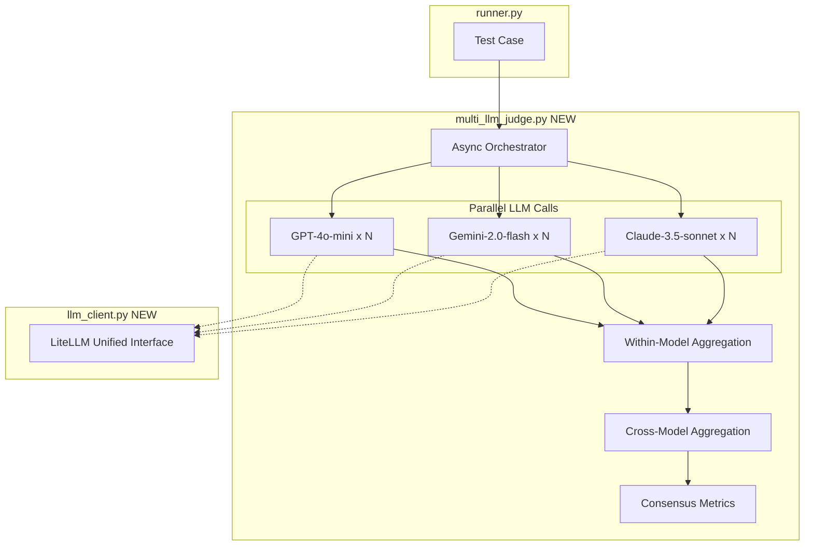
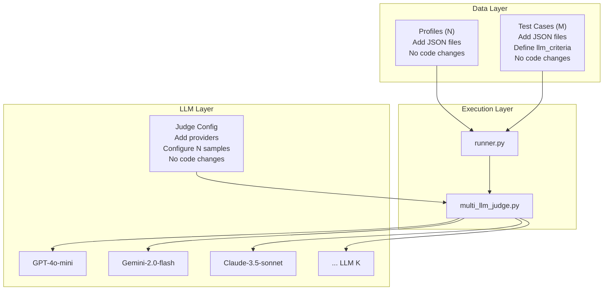

# Phase 6 Revised: Multi-LLM Judge Infrastructure

## Problem Statement

Current LLM evaluation has variability issues (Test 01 passes ~50% of runs with identical inputs). The existing `llm_judge.py` uses:

- Single LLM (Gemini) with `temperature=0.0` (research shows this is suboptimal)
- No repeated sampling
- No uncertainty metrics

## Architecture Overview




## Key Design Decisions


| Decision    | Choice               | Rationale                                                   |
| ----------- | -------------------- | ----------------------------------------------------------- |
| Aggregation | Two-stage mean       | Research-backed: mean within model, then mean across models |
| Temperature | 0.7-0.8              | Research shows temp>0 gives better calibration              |
| Default N   | 3 per judge          | Balance between reliability and cost/time                   |
| Async       | Python asyncio       | Required for <2-3 min runs with multiple LLMs               |
| Fallback    | Graceful degradation | If one LLM fails, continue with others                      |


## Implementation Plan

### Phase 6.1: LiteLLM Integration (Priority 1)

Create [rec/server/llm_client.py](rec/server/llm_client.py) (NEW):

```python
# Unified LLM interface using LiteLLM
import litellm
from litellm import acompletion  # async support

SUPPORTED_MODELS = {
    "openai": "gpt-4o-mini",
    "gemini": "gemini/gemini-2.0-flash", 
    "anthropic": "claude-3-5-sonnet-20241022"
}

async def call_llm(provider: str, prompt: str, temperature: float = 0.8) -> dict:
    model = SUPPORTED_MODELS[provider]
    response = await acompletion(
        model=model,
        messages=[{"role": "user", "content": prompt}],
        temperature=temperature,
        response_format={"type": "json_object"}  # OpenAI/Gemini
    )
    return parse_json_response(response.choices[0].message.content)
```

### Phase 6.2: Multi-LLM Judge System

Create [rec/evaluation/multi_llm_judge.py](rec/evaluation/multi_llm_judge.py) (NEW):

**Configuration Structure:**

```python
JUDGE_CONFIG = {
    "judges": [
        {"provider": "openai", "enabled": True, "n": 3},
        {"provider": "gemini", "enabled": True, "n": 3},
        {"provider": "anthropic", "enabled": False, "n": 3}
    ],
    "temperature": 0.8,
    "aggregation": {
        "within_model": "mean",  # Mean of N samples per model
        "across_models": "mean"  # Mean of all model scores
    },
    "report_uncertainty": True,
    "flag_low_consensus": True,
    "consensus_threshold": 1.5  # std_dev > this = low consensus
}
```

**Core Flow:**

1. For each enabled judge, run N async calls in parallel
2. Aggregate within each model (mean of N samples)
3. Aggregate across models (mean of per-model scores)
4. Compute consensus metrics (std_dev, confidence level)
5. Flag for review if consensus is low

### Phase 6.3: Two-Stage Aggregation

```python
def aggregate_within_model(samples: list[dict]) -> dict:
    """Mean of N samples from same model."""
    scores = {
        "relevance": np.mean([s["relevance_score"] for s in samples]),
        "diversity": np.mean([s["diversity_score"] for s in samples]),
        "quality": np.mean([s["quality_score"] for s in samples]),
        "hypothesis_alignment": np.mean([s["content_hypothesis_alignment"] for s in samples]),
    }
    scores["test_pass"] = np.mean([1 if s["test_pass"] else 0 for s in samples]) >= 0.5
    scores["within_model_std"] = np.std([...])  # Report uncertainty
    return scores

def aggregate_across_models(model_scores: dict[str, dict]) -> dict:
    """Mean of per-model aggregated scores."""
    all_scores = list(model_scores.values())
    final = {
        "relevance_score": np.mean([s["relevance"] for s in all_scores]),
        "diversity_score": np.mean([s["diversity"] for s in all_scores]),
        # ... etc
    }
    final["cross_model_std"] = np.std([...])  # Uncertainty across models
    final["consensus_level"] = categorize_consensus(final["cross_model_std"])
    return final
```

### Phase 6.4: Enhanced Report Structure

New criterion result format in test reports:

```json
{
  "criterion_id": "llm_hypothesis_alignment",
  "llm_evaluations": {
    "openai_gpt-4o-mini": {
      "samples": [6.0, 7.0, 6.5],
      "aggregated_score": 6.5,
      "within_model_std": 0.41
    },
    "google_gemini-2.0-flash": {
      "samples": [5.0, 6.0, 5.5],
      "aggregated_score": 5.5,
      "within_model_std": 0.41
    }
  },
  "consensus_metrics": {
    "final_score": 6.0,
    "cross_model_std": 0.71,
    "consensus_level": "PARTIAL",
    "confidence": "MEDIUM",
    "flag_for_review": false
  },
  "passed": true,
  "threshold": 6.0
}
```

### Phase 6.5: Async Parallel Execution

Update [rec/evaluation/runner.py](rec/evaluation/runner.py):

```python
import asyncio
from multi_llm_judge import evaluate_with_multi_llm

async def run_llm_evaluations_parallel(test_cases: list, profiles: dict):
    """Run all LLM evaluations in parallel using asyncio."""
    tasks = []
    for test_id, test_case in test_cases.items():
        if test_case.get("evaluation_method") in ("deterministic_llm", "llm_only"):
            tasks.append(evaluate_with_multi_llm(test_case, profile, response))
    
    results = await asyncio.gather(*tasks, return_exceptions=True)
    return results
```

### Phase 6.6: Error Handling & Graceful Degradation

```python
async def evaluate_with_multi_llm(...):
    results = {}
    for judge in enabled_judges:
        try:
            samples = await asyncio.gather(*[call_llm(judge, prompt) for _ in range(n)])
            results[judge] = aggregate_within_model(samples)
        except Exception as e:
            results[judge] = {"error": str(e), "skipped": True}
    
    # Continue with available results
    valid_results = {k: v for k, v in results.items() if not v.get("skipped")}
    if not valid_results:
        raise AllJudgesFailedError("All LLM judges failed")
    
    return aggregate_across_models(valid_results)
```

## Files to Create/Modify


| File                                | Action | Purpose                                      |
| ----------------------------------- | ------ | -------------------------------------------- |
| `rec/server/llm_client.py`          | CREATE | LiteLLM unified interface                    |
| `rec/evaluation/multi_llm_judge.py` | CREATE | Multi-LLM orchestration + aggregation        |
| `rec/evaluation/llm_judge.py`       | MODIFY | Keep as fallback, update temperature to 0.8  |
| `rec/evaluation/runner.py`          | MODIFY | Integrate multi-LLM judge, add async support |
| `rec/evaluation/judge_config.json`  | CREATE | Externalized judge configuration             |
| `rec/requirements.txt`              | MODIFY | Add `litellm>=1.30.0`                        |


## Cost & Time Estimates

Assuming 7 tests with 4 LLM-criteria each:

- **With 2 judges, N=3**: 7 × 4 × 2 × 3 = 168 API calls
- **Estimated cost**: ~$0.15-0.25 per full run (gpt-4o-mini + gemini-flash are cheap)
- **Estimated time**: 45-90 seconds with async parallelization

## Migration Path

1. Implement LiteLLM client first (backward compatible)
2. Create multi_llm_judge.py alongside existing llm_judge.py
3. Add `--multi-llm` flag to runner.py
4. Deprecate single-LLM mode after validation

---

## Compatibility & Independence Fixes

### Problem: Unused `llm_criteria` in Test Cases

Current test cases define `llm_criteria` with `focus_areas` and `prompt_hint`, but these are **never used** in the LLM prompt. Example from `05_category_personalization.json`:

```json
"llm_criteria": {
  "enabled": true,
  "focus_areas": ["relevance", "category_alignment", "cross_disciplinary_coherence"],
  "prompt_hint": "Evaluate if (1) recommendations match the user's primary category..."
}
```

This data is loaded but ignored in `llm_judge.py` (lines 299-305).

### Solution: Dynamic Prompt Builder

Update [rec/evaluation/multi_llm_judge.py](rec/evaluation/multi_llm_judge.py) to incorporate test-case-specific criteria:

```python
def build_evaluation_prompt(profile: dict, response: dict, test_case: dict) -> str:
    """Build LLM prompt that incorporates test-specific llm_criteria."""
    
    llm_criteria = test_case.get("llm_criteria", {})
    focus_areas = llm_criteria.get("focus_areas", ["relevance", "diversity", "quality", "hypothesis_alignment"])
    prompt_hint = llm_criteria.get("prompt_hint", "")
    
    # Build dynamic criteria section based on focus_areas
    criteria_section = build_criteria_section(focus_areas)
    
    prompt = EVALUATION_PROMPT_TEMPLATE.format(
        profile_summary=format_profile_summary(profile),
        content_hypothesis=extract_content_hypothesis(profile),
        engagements_summary=format_engagements_summary(profile.get("engagements", [])),
        recommendations_summary=format_recommendations_summary(response.get("episodes", [])),
        test_description=f"{test_case.get('name', 'Unknown')}: {test_case.get('description', '')}",
        additional_guidance=prompt_hint,  # NEW: Include test-specific guidance
        evaluation_criteria=criteria_section  # NEW: Dynamic criteria based on focus_areas
    )
    return prompt

# Criteria definitions (can be extended without code changes)
CRITERIA_DEFINITIONS = {
    "relevance": "RELEVANCE (1-5): Do recommendations match the user's interests?",
    "diversity": "DIVERSITY (1-5): Does diversity level match Content Hypothesis?",
    "quality": "QUALITY (1-5): Are high-quality episodes (credibility >= 3) surfaced?",
    "hypothesis_alignment": "HYPOTHESIS_ALIGNMENT (1-5): How well do recommendations align with Content Hypothesis?",
    "category_alignment": "CATEGORY_ALIGNMENT (1-5): Do recommendations match user's primary category?",
    "cross_disciplinary_coherence": "CROSS_DISCIPLINARY (1-5): Are outside-category items contextually linked?",
    "personalization_strength": "PERSONALIZATION (1-5): How strongly do recommendations reflect engagement history?",
    "topic_breadth": "TOPIC_BREADTH (1-5): Do recommendations span multiple major themes?"
}

def build_criteria_section(focus_areas: list[str]) -> str:
    """Build criteria section from focus_areas list."""
    lines = []
    for i, area in enumerate(focus_areas, 1):
        if area in CRITERIA_DEFINITIONS:
            lines.append(f"{i}. **{CRITERIA_DEFINITIONS[area]}**")
    return "\n\n".join(lines)
```

### Updated Prompt Template

```python
EVALUATION_PROMPT_TEMPLATE = """You are evaluating a podcast recommendation system...

## User Profile
{profile_summary}

## Content Hypothesis
{content_hypothesis}

## Recent Engagements
{engagements_summary}

## For You Feed (Top 10 Recommendations)
{recommendations_summary}

## Test Case Being Evaluated
{test_description}

## Additional Guidance
{additional_guidance}

## Evaluation Criteria

{evaluation_criteria}

## Response Format
...
"""
```

---

## Independence Architecture

With these changes, all three layers scale independently:



### Scaling Examples

| To Add... | Action Required | Code Changes |
|-----------|-----------------|--------------|
| New Profile | Add `profiles/09_new_profile.json` | None |
| New Test Case | Add `test_cases/08_new_test.json` with `llm_criteria` | None |
| New LLM Provider | Add to `judge_config.json` | None |
| New Evaluation Criterion | Add to `CRITERIA_DEFINITIONS` dict | 1 line |

### Test Case JSON Schema (Updated)

```json
{
  "test_id": "08_new_test",
  "name": "New Test Name",
  "evaluation_method": "deterministic_llm",
  "llm_criteria": {
    "enabled": true,
    "focus_areas": ["relevance", "category_alignment", "custom_criterion"],
    "prompt_hint": "Specific guidance for this test...",
    "custom_criteria": {
      "custom_criterion": {
        "name": "CUSTOM (1-5)",
        "description": "Evaluate custom aspect..."
      }
    }
  },
  "pass_criteria": [...],
  "setup": {...}
}
```

---

## Updated Files to Create/Modify

| File | Action | Purpose |
|------|--------|---------|
| `rec/server/llm_client.py` | CREATE | LiteLLM unified interface |
| `rec/evaluation/multi_llm_judge.py` | CREATE | Multi-LLM orchestration + dynamic prompts |
| `rec/evaluation/llm_judge.py` | MODIFY | Update temperature, add fallback mode |
| `rec/evaluation/runner.py` | MODIFY | Integrate multi-LLM judge, async support |
| `rec/evaluation/judge_config.json` | CREATE | Externalized judge configuration |
| `rec/evaluation/criteria_definitions.py` | CREATE | Extensible criteria registry |
| `rec/requirements.txt` | MODIFY | Add `litellm>=1.30.0` |

## Remaining Phase 6 Items (Unchanged)

- Phase 6.1: Qdrant Integration (separate from this)
- Phase 6.4: Docker Deployment
- Phase 6.5: Data Handling
- Phase 6.6: UI Polish

